# Reed Turgeon's Portfolio
Welcome to my portfolio!

🌎 [Hosted Netlify Project](https://turgeonportfolio.netlify.app) 🌎

## My Info
| title     | link                                                          | 
| ---       | ---                                                           |
| LinkedIn  | [/in/reedturgeon/](https://www.linkedin.com/in/reedturgeon/)  |
| Github    | [/MrT3313](https://github.com/MrT3313)                        |
| Email     | turgeon.dev@gmail.com                                         |
| Phone     | 508 - 446 - 6633                                              | 

## Stack

| name                  | description                           | 
| ---                   | ---                                   | 
| React                 | UI Component Library                  |  
| Styled-Components     | Component Scopped Styling Library     | 

## Versions

<details open>
<summary>1.3.0 - Skills Footer w/ Icons</summary>

- Added an additional footer with icons of some development skills

Screenshot:   
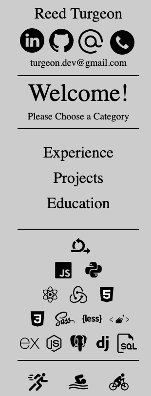 
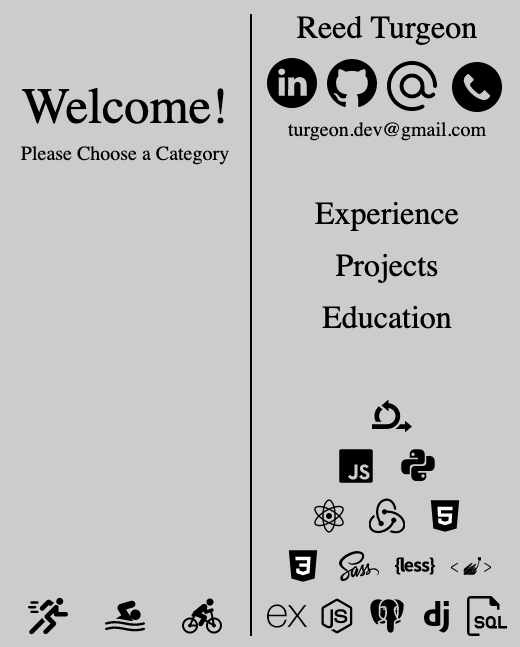 


</details>
<details open>
<summary>1.2.0 - Switched to Mobile First Styling</summary>

- Media Queries were getting out of hand while not really hitting the functionality that was needed 
- Mobile Version == `window.innderWidth <= 500`
- Desktop Version == `window.innerWidth > 500`
- Reogranized repo to match with mobile first

Screenshot:   
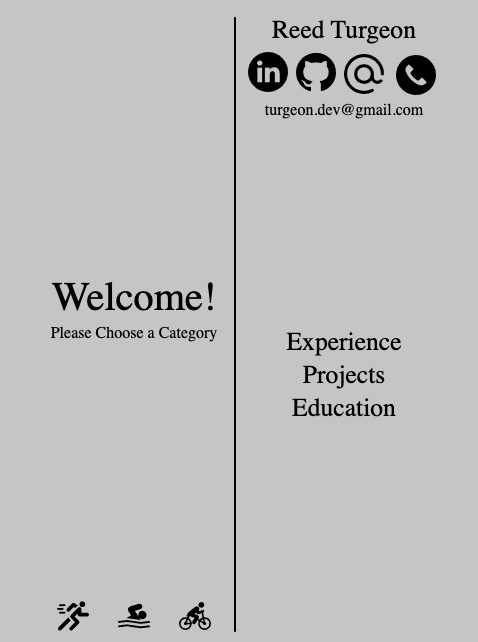 
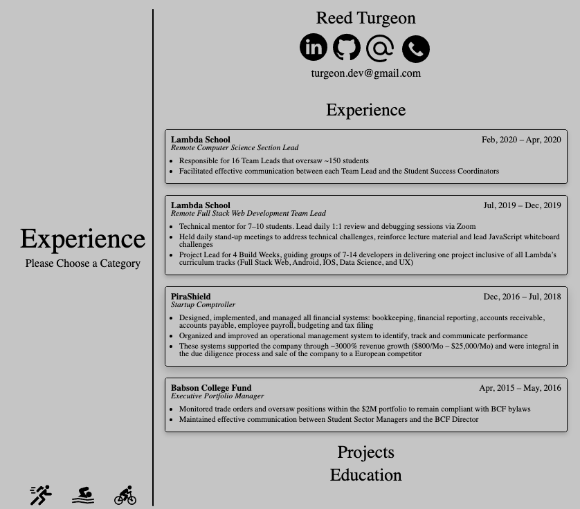

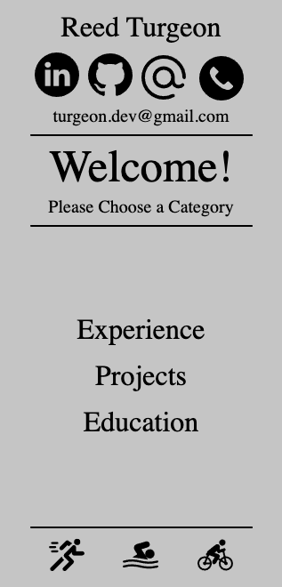
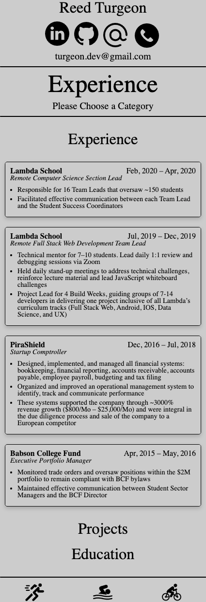 
    
     
- Updated Repo Structure
    ```
    │   └── src
    │       ├── App.js
    │       ├── index.js
    │       ├── assets
    │       │   ├── icons
    │       │   │   ├── ...
    │       │   └── readMe
    │       │       ├── ...
    │       ├── components
    │       │   ├── HomepageLine.js
    │       │   ├── ProjectItem.js
    │       │   ├── SelectedTitle.js
    │       │   ├── desktopHomepage
    │       │   │   ├── HomepageLeft.js
    │       │   │   └── HomepageRight.js
    │       │   ├── footer
    │       │   │   └── Footer.js
    │       │   ├── header
    │       │   │   ├── ContactItem.js
    │       │   │   ├── Header.js
    │       │   │   └── SocialItem.js
    │       │   └── selector
    │       │       ├── HomepageSelector.js
    │       │       ├── itemFactory
    │       │       │   ├── Education.js
    │       │       │   ├── Experience.js
    │       │       │   └── Projects.js
    │       │       └── items
    │       │           ├── EducationItem.js
    │       │           ├── ExperienceItem.js
    │       │           └── ProjectItem.js
    │       ├── styles
    │       │   ├── index.css
    │       │   ├── responsiveSizes.js
    │       │   └── theme.js
    │       └── views
    │           ├── Resume.js
    │           └── homepage
    │               ├── HomepageMobile.js
    │               └── HomepageTabletDesktop.js
    ```

</details>


<details>
<summary>1.1.3 - Education Category Update</summary>

1. font-size / font-weight / font-style => used to emphasize items in `<Education />` & `<EducationItem />`
2. `src > components > homepage > RIGHT` directory reorg to better organize components and logic

- Updated Repo Structure
    ```
    │   └── src
    │       ├── App.js
    │       ├── assets
    │       ├── components
    │       │   ├── HomepageLine.js
    │       │   └── homepage
    │       │       ├── LEFT
    │       │       │   ├── HomepageLeft.js
    │       │       │   └── SelectedTitle.js
    │       │       └── RIGHT
    │       │           ├── HomepageRight.js
    │       │           ├── header
    │       │           │   ├── ContactItem.js
    │       │           │   ├── Header.js
    │       │           │   └── SocialItem.js
    │       │           └── selector
    │       │               ├── HomepageSelector.js
    │       │               ├── itemFactory
    │       │               │   ├── Education.js
    │       │               │   ├── Experience.js
    │       │               │   └── Projects.js
    │       │               └── items
    │       │                   ├── EducationItem.js
    │       │                   ├── ExperienceItem.js
    │       │                   └── ProjectItem.js
    │       ├── index.js
    │       ├── styles
    │       │   ├── index.css
    │       │   └── theme.js
    │       └── views
    │           ├── Homepage.js
    │           └── Resume.js
    ```

Screenshot:   
    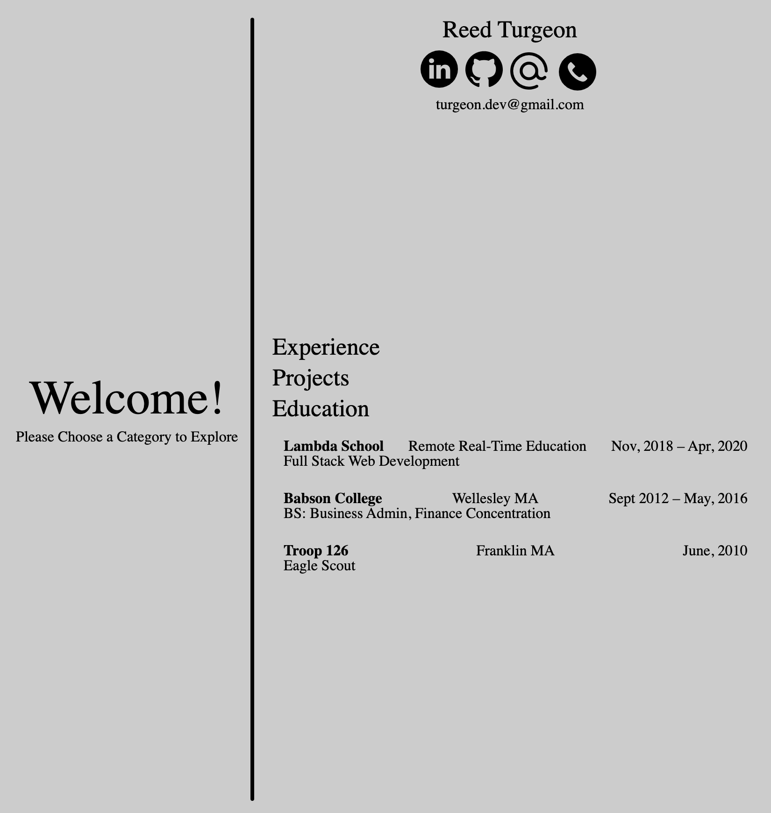 
</details>


<details>
<summary>1.1.2 - Projects Category Update</summary>

1. font-size / font-weight / font-style => used to emphasize items in `<Projects />` & `<ProjectItem />`

Screenshot:   
    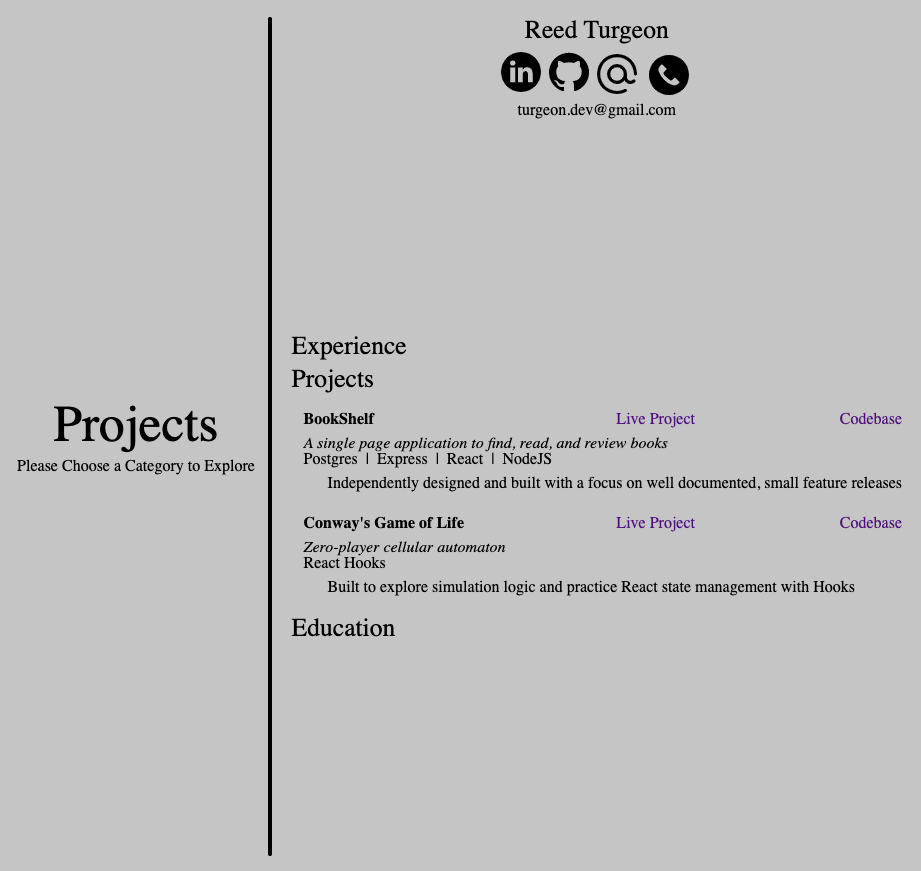 

</details>

<details>
<summary>1.1.1 - Education Category Update</summary>

1. font-size / font-weight / font-style => used to emphasize items in `<Exprience />` & `<ExperienceItem />`
2. Passed experience title moved from `TOP` to newly created `MIDDLE` div
3. `BOTTOM` div default `display: none` & `:hover` pseudo selector rendering descriptive bullets as user scrolls over an individual `<ExperienceItem />` 
4. Cleaned up class naming across app

Screenshot:   
    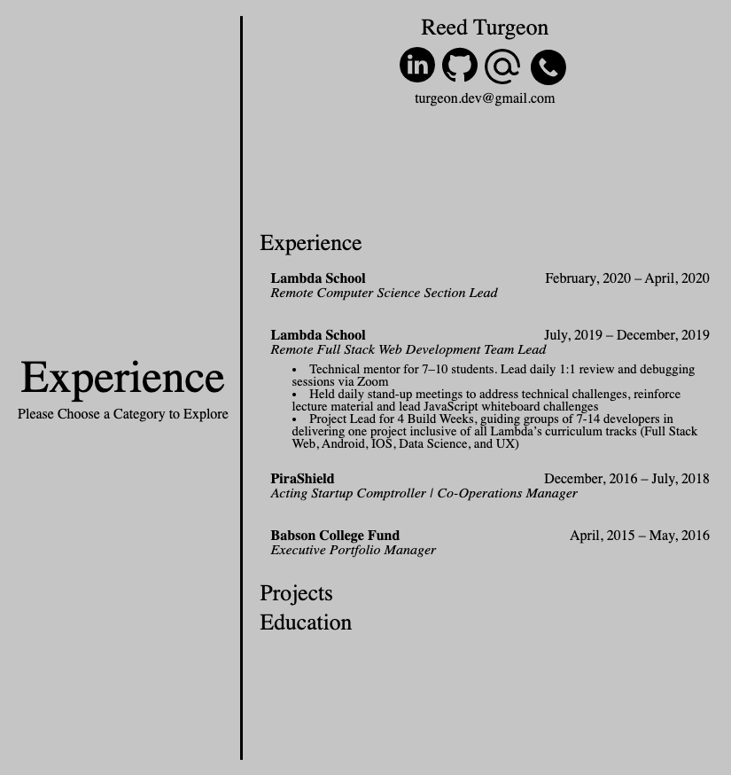 
</details>

<details>
<summary>1.1.0 - Homepage Styling Update & Initial Category Content</summary>

1. Font-Sizes changed from `px` to `rem` based on `body { font-size: 62.5% }` in `src > styles > index.css`
2. `<Header />` Social & Contact links 
    - `onMouseEnter()` => updating displayed path
    - `onClick()` => forwarding correctly
        - Linkedin & Github => opening a new tab w/ `target=_blank`
        - Email => Opening client's default email provider with `mailto:{email}` 
            - if client does not have a default email provider `onClick()` will have no affect
        - Phone => no `onClick()` logic
3. Initial content & rendering for: 
    - `<Experience />` & `<ExperienceItem />`
    - `<Projects />` & `<ProjectItem />` 
    - `<Education />` & `<EducationItem />`

Screenshot:   
    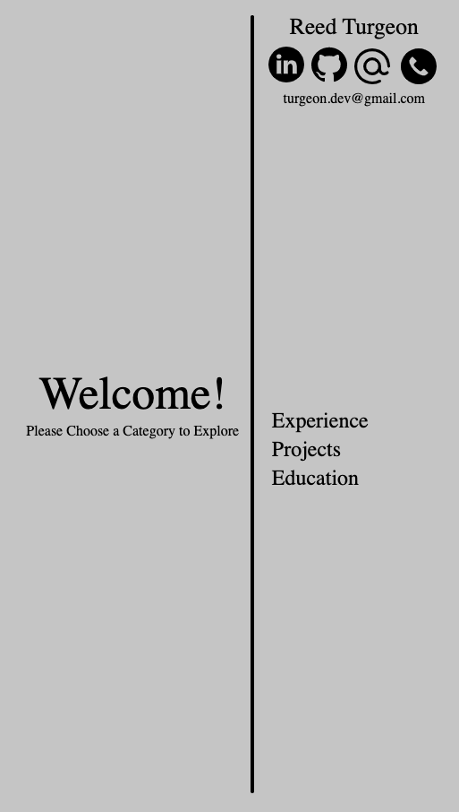 
</details>

<details>
<summary>1.0.0 - Initial Outline & Hosting</summary>

[Hosted Netlify Project](https://turgeonportfolio.netlify.app)

1. Initial Homepage Outline & Content
2. Active Title Updating
    - `<li onMouseEnter()>` => Updates `<SelectedTitle>` value
    - `<StyledHomepageSelector onMouseLeave() => Resets `SelectedTitle>` to 'Welcome!'/>`
3. Netlify Hosting

Screenshot:   
    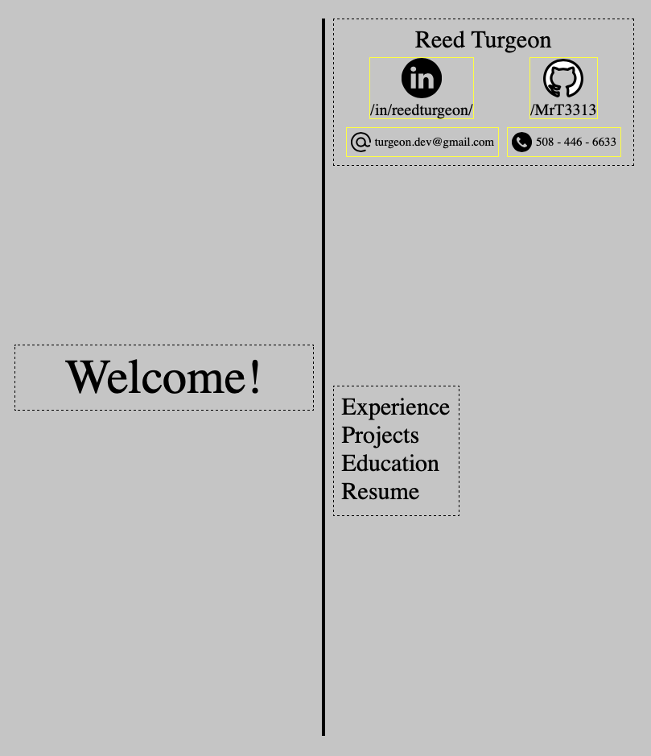 
</details>

<details>
<summary>0.1.0 - Initial Commit</summary>

1. Create React App (CRA) refactored
2. Initial `<ThemeProvider>` 
    - wrapping main `<App />` component 
    - `index.js` importing `AppTheme` object from `theme.js` and passing it into `theme` prop
    ```javascript
        <ThemeProvider theme={AppTheme}>
    ```

</details>

## Assets

### Header Icons
| title                       | credit / author                        | icon link                                                                                      | 
| ---                         | ---                                    | ---                                                                                            |
| LinkedIn                    | Freepick on flaticon.com               | [link](https://www.flaticon.com/free-icon/linkedin_1384014?term=linkedin&page=1&position=1)    |
| Github                      | Pixel Perfect on flaticon.com          | [link](https://www.flaticon.com/free-icon/github_2111432)                                      |
| AtSymbol                    | Freepick on flaticon.com               | [link](https://www.flaticon.com/free-icon/at_2658139)                                          |
| Phone                       | Creaticca Creative Agency flaticon.com | [link](https://www.flaticon.com/free-icon/phone-call_455705)                                   |

### Skills Footer
| title                       | credit / author                        | icon link                                                                                      | 
| ---                         | ---                                    | ---                                                                                            |
| Agile Development           | Freepick on Flaticon.com               | [link](https://www.flaticon.com/free-icon/agile_2784037?term=Agile&page=1&position=3)          | 
| JS                          | Icons8.com                             | [link](https://icons8.com/icons/set/javascript)                                                |
| Python                      | Icons8.com                             | [link](https://icons8.com/icons/set/python)                                                    |
| React                       | Iconscout.com                          | [link](https://iconscout.com/icon/react-1543566)                                               | 
| Redux                       | Iconscout.com                          | [link](https://iconscout.com/icon/redux)                                                       |
| HTML5                       | Vecta.io                               | [link](https://www.vectorlogo.zone/logos/w3_html5/index.html)                                  | 
| CSS3                        | Vipping.com                            | [link](https://www.vippng.com/preview/iobbxih_css-logo-png-css-black-icon-svg/)                |
| Sass                        | Icons8.com                             | [link](https://icons8.com/icons/set/sass-logo)                                                 |
| LESS                        | Icons8.com                             | [link](https://icons8.com/icons/set/less-logo)                                                 |
| Styled Components           | Simpleicons.org                        | [link](https://simpleicons.org/?q=Styled)                                                      |
| ExpressJS                   | Vectorlogo.zone                        | [link](https://www.vectorlogo.zone/logos/expressjs/index.html)                                 |
| NodeJS                      | Vectorlogo.zone                        | [link](https://www.vectorlogo.zone/logos/nodejs/index.html)                                    |
| PostgreSQL                  | Icons8.com                             | [link](https://icons8.com/icons/set/postgresql)                                                |
| Django                      | Icons8.com                             | [link](https://icons8.com/icons/set/django)                                                    |
| SQL                         | Smartline on flaticon.com              | [link](https://www.flaticon.com/free-icon/files_569809?term=sql&page=1&position=5)             |

### Hobbies Footer
| title                       | credit / author                        | icon link                                                                                      | 
| ---                         | ---                                    | ---                                                                                            |
| Runner                      | Freepick on flaticon.com               | [link](https://www.flaticon.com/free-icon/running_763965?term=running&page=1&position=10)      |
| Swimmer                     | Freepick on flaticon.com               | [link](https://www.flaticon.com/free-icon/swimmer_2932366?term=swimmer&page=1&position=3)      | 
| Biker                       | Freepick on flaticon.com               | [link](https://www.flaticon.com/free-icon/bicycle-rider_71422)                                 | 


<!-- | Fishing Hooks (React Hooks) | Freepik on flaticon.com                | [link](https://www.flaticon.com/free-icon/hook_120183)                                         |  -->